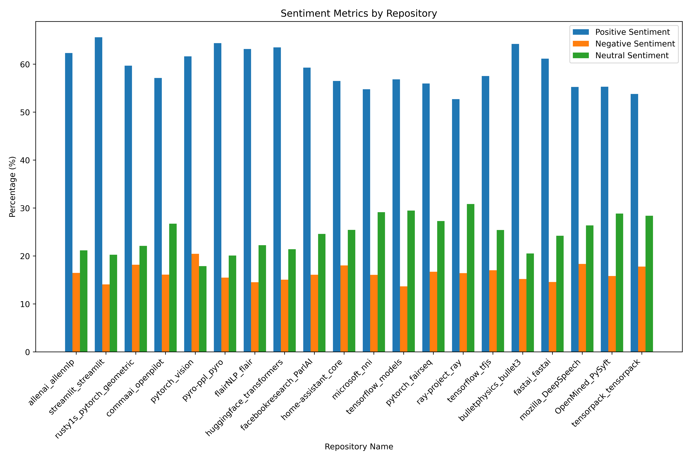
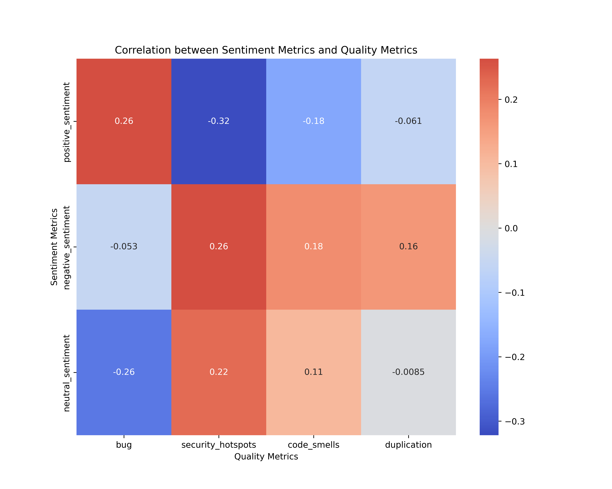
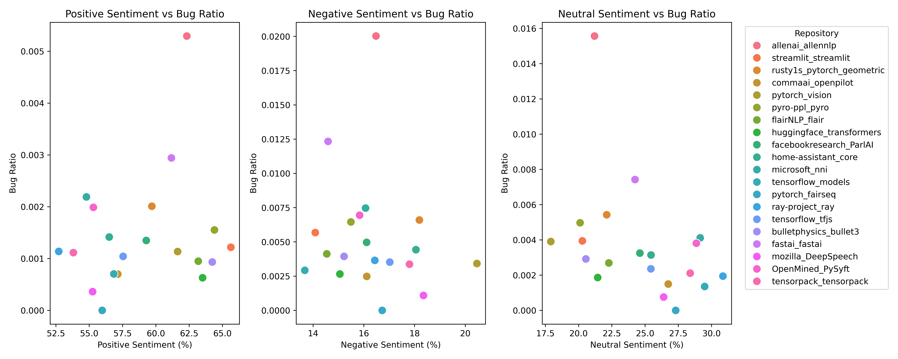
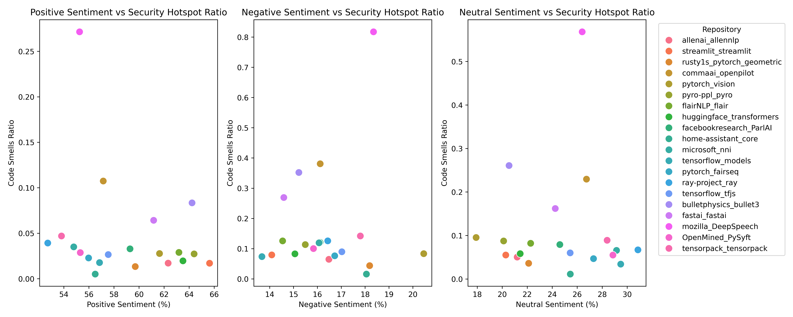
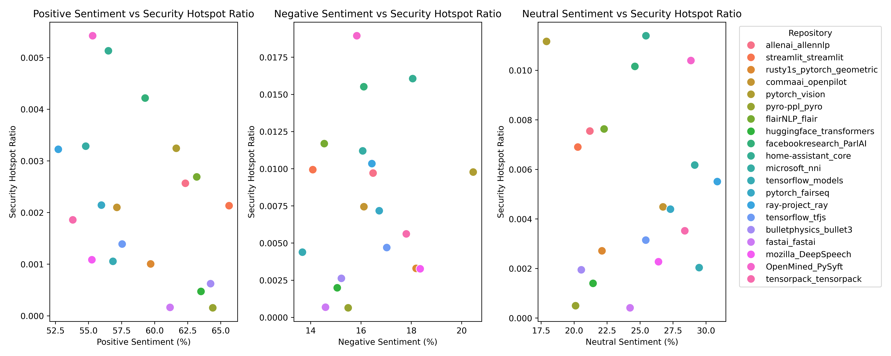
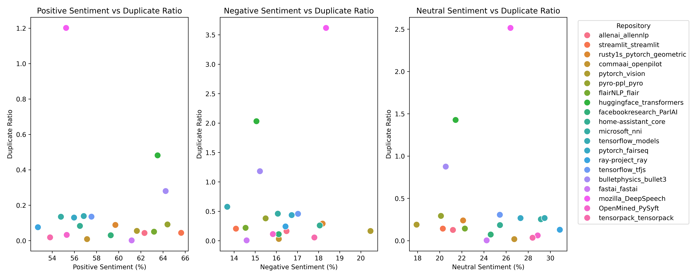

# Sentiment Analysis and Code Quality in Machine Learning Projects

[](https://arxiv.org/abs/2409.17885)
[](https://www.python.org/)
[](https://jupyter.org/)

This repository contains the dataset, analysis notebooks, and visualizations for the research paper:

**Sentiment Analysis of ML Projects: Bridging Emotional Intelligence and Code Quality**

**Authors:** Md Shoaib Ahmed, Dongyoung Park, and Nasir U. Eisty  
**Affiliation:** Department of Computer Science, Boise State University  
**Paper:** [arXiv:2409.17885](https://arxiv.org/abs/2409.17885)

---

## Overview

Software engineering is not only a technical process but also a collaborative and communication-driven activity. Developers express opinions, emotions, concerns, and feedback through issue discussions, comments, commits, and other textual interactions.

This project investigates the relationship between **developer sentiment** and **code quality** in popular machine learning projects. It analyzes GitHub issue comments using multiple sentiment analysis tools and compares the resulting sentiment patterns with code-quality metrics collected using SonarQube.

The goal is to understand whether positive, negative, and neutral developer sentiments are associated with project-level quality indicators such as bugs, vulnerabilities, security hotspots, code smells, and code duplication.

---

## Research Questions

This study focuses on the following research questions:

1. What is the overall sentiment of developers in machine learning projects?
2. How do popular machine learning projects perform in terms of code quality?
3. How does developer sentiment relate to bugs?
4. What is the relationship between developer sentiment and code smells?
5. How does developer sentiment relate to security hotspots?
6. Is there a relationship between developer sentiment and code duplication?

---

## Methodology

The overall workflow of this project is:

```text
GitHub ML Repositories
        |
        v
Issue Comment Collection
        |
        v
Text Preprocessing
        |
        v
Sentiment Analysis
(VADER, TextBlob, Pattern, BERT, spaCy)
        |
        v
Max-Voting Sentiment Labeling
        |
        v
SonarQube Code Quality Metrics
        |
        v
Sentiment and Code Quality Relationship Analysis
```

### 1. Data Collection

GitHub issue comments were collected from selected high-engagement machine learning repositories. The projects were selected based on popularity, activity, and availability of sufficient issue-comment data.

### 2. Data Preprocessing

The collected comments were cleaned and normalized before sentiment analysis. The preprocessing steps include:

- Removing duplicate comments
- Removing very short or irrelevant comments
- Removing URLs, numbers, and special characters
- Converting emojis into textual form
- Lowercasing text
- Removing stop words
- Filtering non-English terms
- Applying stemming and lemmatization

### 3. Sentiment Analysis

Multiple sentiment analysis tools were used to classify developer comments:

- VADER
- TextBlob
- Pattern
- BERT-based sentiment analysis
- spaCy with SpacyTextBlob

Since different tools may produce different sentiment labels, a **max-voting strategy** was used to determine the final sentiment label. The sentiment label predicted by the majority of tools was selected as the final label.

### 4. Code Quality Analysis

Code quality was analyzed using SonarQube. The study considers the following code-quality metrics:

- Bugs
- Vulnerabilities
- Security hotspots
- Code smells
- Code duplication

The final analysis investigates how positive, negative, and neutral sentiment patterns relate to these code-quality indicators.

---

## Repository Structure

```text
sentiment-analysis-and-code-quality/
│
├── Dataset/
│   ├── Raw Dataset/
│   │   └── Raw repository and project-level data
│   │
│   ├── Processed Dataset/
│   │   └── Cleaned and sentiment-processed datasets
│   │
│   └── Final/
│       └── sentiment_codeQuality_relationship.csv
│
├── Diagrams/
│   ├── 3d_scatter_plot_clustered.png
│   ├── bug_by_repository.png
│   ├── bug_ratio_scatter_plot.png
│   ├── code_smells_by_repository.png
│   ├── code_smells_ratio_scatter_plot.png
│   ├── correlation_heatmap.png
│   ├── duplicate_ratio_scatter_plot.png
│   ├── duplication_by_repository.png
│   ├── negative_sentiment_by_repository.png
│   ├── neutral_sentiment_by_repository.png
│   ├── normalized_quality_metrics_by_repository_stacked.png
│   ├── parallel_coordinates_plot.png
│   ├── positive_sentiment_by_repository.png
│   ├── quality_metrics_by_repository_grouped.png
│   ├── quality_metrics_by_repository_line_chart.png
│   ├── security_hotspot_ratio_scatter_plot.png
│   ├── security_hotspots_by_repository.png
│   ├── sentiment_metrics_by_repository.png
│   ├── sentiment_metrics_by_repository_stacked.png
│   └── violin_plot.png
│
└── code/
    ├── data-collection-and-sentiment.ipynb
    └── results.ipynb
```

---

## Dataset

The final dataset combines repository-level sentiment statistics with SonarQube-based code-quality metrics.

The final merged dataset is located at:

```text
Dataset/Final/sentiment_codeQuality_relationship.csv
```

Main columns include:

| Column | Description |
|---|---|
| `file_name` | Repository or project identifier |
| `positive_sentiment` | Percentage of positive comments |
| `negative_sentiment` | Percentage of negative comments |
| `neutral_sentiment` | Percentage of neutral comments |
| `positive_total` | Total number of positive comments |
| `negative_total` | Total number of negative comments |
| `neutral_total` | Total number of neutral comments |
| `total_num_of_sentiment` | Total number of analyzed comments |
| `Lines of Code` | Project size measured by lines of code |
| `Bugs(Reliability)` | Number of reliability-related bugs |
| `Vulnerabilities` | Number of security vulnerabilities |
| `Security Hotspots(Security Review)` | Number of security hotspots |
| `Code Smells(Maintainability)` | Number of maintainability issues |
| `duplication` | Code duplication percentage |

---

## Getting Started

### 1. Clone the Repository

```bash
git clone https://github.com/shoaibmehrab/sentiment-analysis-and-code-quality.git
cd sentiment-analysis-and-code-quality
```

### 2. Create a Virtual Environment

For macOS/Linux:

```bash
python -m venv .venv
source .venv/bin/activate
```

For Windows:

```bash
python -m venv .venv
.venv\Scripts\activate
```

### 3. Install Required Packages

```bash
pip install pandas numpy matplotlib seaborn scikit-learn nltk emoji requests jupyter
pip install vaderSentiment textblob pattern spacy spacytextblob transformers torch
python -m spacy download en_core_web_sm
```

You may also need to download NLTK resources:

```python
import nltk

nltk.download("punkt")
nltk.download("stopwords")
nltk.download("wordnet")
nltk.download("words")
nltk.download("vader_lexicon")
```

---

## How to Run

### Step 1: Data Collection and Sentiment Analysis

Open and run the following notebook:

```text
code/data-collection-and-sentiment.ipynb
```

This notebook includes the workflow for:

- Collecting GitHub issue comments
- Cleaning and preprocessing text
- Applying sentiment analysis tools
- Combining sentiment labels using max voting
- Saving processed sentiment datasets

If you collect new GitHub data, you may need a GitHub personal access token to avoid API rate limits.

### Step 2: Result Analysis and Visualization

Open and run the following notebook:

```text
code/results.ipynb
```

This notebook includes the workflow for:

- Aggregating repository-level sentiment results
- Merging sentiment data with code-quality metrics
- Computing relationships between sentiment and quality indicators
- Generating visualizations

Generated figures are stored in:

```text
Diagrams/
```

---

## Example Visualizations

### Sentiment Metrics by Repository



### Correlation Heatmap



### Bug Ratio Scatter Plot



### Code Smells Ratio Scatter Plot



### Security Hotspot Ratio Scatter Plot



### Duplicate Ratio Scatter Plot



---

## Key Findings

The study shows that developer sentiment in machine learning projects is generally connected with project-level code quality.

The analysis indicates that positive developer sentiment is associated with better code-quality indicators, including fewer bugs and fewer code smells. In contrast, negative sentiment is associated with increased quality issues, including higher duplication and greater security-related concerns.

These findings suggest that developer communication and emotional dynamics may provide useful signals for understanding the health and maintainability of software projects.

---

## Technologies Used

- Python
- Jupyter Notebook
- Pandas
- NumPy
- Matplotlib
- Seaborn
- NLTK
- VADER
- TextBlob
- Pattern
- BERT
- spaCy
- SpacyTextBlob
- SonarQube

---

## Limitations

This study focuses on selected popular machine learning repositories and may not generalize to all software projects. Sentiment analysis in software engineering text is challenging because developer comments often contain technical terms, short messages, code snippets, sarcasm, and context-dependent expressions.

SonarQube provides useful static-analysis metrics, but it does not capture every aspect of software quality, such as architectural quality, team productivity, code review quality, or long-term maintainability.

---

## Citation

If you use this repository, dataset, or analysis in your research, please cite the paper:

```bibtex
@article{ahmed2024sentiment,
  title={Sentiment Analysis of ML Projects: Bridging Emotional Intelligence and Code Quality},
  author={Ahmed, Md Shoaib and Park, Dongyoung and Eisty, Nasir U.},
  journal={arXiv preprint arXiv:2409.17885},
  year={2024}
}
```

---

## Authors

- **Md Shoaib Ahmed**  
  Department of Computer Science, Boise State University

- **Dongyoung Park**  
  Department of Computer Science, Boise State University

- **Nasir U. Eisty**  
  Department of Computer Science, Boise State University

---

## Related Links

- Paper: [https://arxiv.org/abs/2409.17885](https://arxiv.org/abs/2409.17885)
- Repository: [https://github.com/shoaibmehrab/sentiment-analysis-and-code-quality](https://github.com/shoaibmehrab/sentiment-analysis-and-code-quality)

---

## License

This repository currently does not specify a license. Please add a `LICENSE` file before public reuse or distribution.

Recommended options:

- MIT License
- Apache License 2.0
- BSD 3-Clause License

---

## Acknowledgement

This project was conducted as part of research on developer sentiment, emotional intelligence, and code quality in machine learning software projects.
